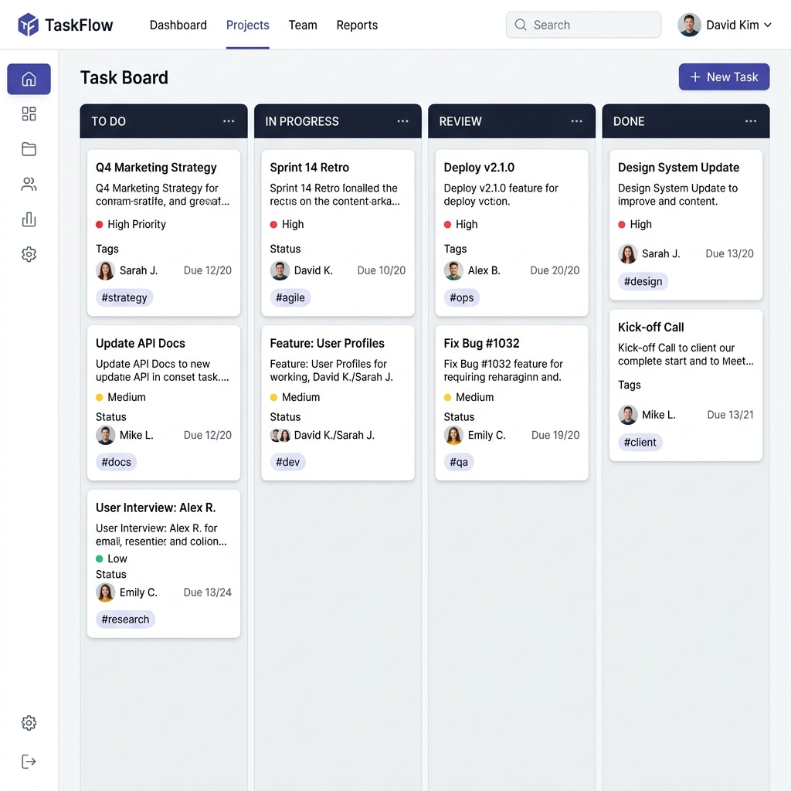

# TaskFlow 🚀

Manage your team's tasks with ease. TaskFlow is a powerful, modern task management system designed for high-velocity teams who demand clarity and efficiency in their digital workspace.

## 📸 Screenshots

| Dashboard Overview | Task Management |
| --- | --- |
|  |  |

---

## ✨ Key Features

### 📊 Comprehensive Dashboard
- **Real-time Stats**: Instantly view Total Tasks, Active Tasks, Completed Tasks, and Overdue Tasks.
- **Recent Activity**: Track the latest updates across all projects.
- **Personalized View**: Users see their own tasks, while Admins get a full system overview.

### 📁 Advanced Project Management
- **Ownership & Collaboration**: Each project has a dedicated owner and can have multiple team members.
- **Bento-Grid UI**: Projects are displayed in a modern, card-based layout for better visibility.
- **Project Health**: Visual indicators of project progress and task distribution.

### ✅ Task Lifecycle & Tracking
- **Granular Control**: Set Priority (Low, Medium, High) and Status (To Do, In Progress, Completed).
- **Deadlines**: Automatic overdue tracking based on due dates.
- **Assignments**: Effortlessly assign tasks to team members with automatic notification logic.

### 👥 Team & User Management
- **Role-Based Access (RBAC)**: Distinct permissions for Admins and regular Team Members.
- **Extended Profiles**: Track important member data like Date of Birth (DOB) and Personal Email.
- **Automated Credentialing**: System-generated passwords for new members with secure storage.

---

## 🛠️ Technical Architecture

### **Backend (Laravel 12.x)**
- **Eloquent ORM**: Complex relationships between Users, Projects, and Tasks (Many-to-Many & One-to-Many).
- **Middleware**: Secure routes ensuring only authorized users can access sensitive data.
- **Sanctum API**: Stateful authentication for SPA and external mobile integrations.

### **Frontend (Modern Stack)**
- **Tailwind CSS**: A custom-themed design system using HSL colors for a premium look.
- **Alpine.js**: Lightweight reactivity for modals, dropdowns, and dynamic UI elements.
- **Blade Components**: Reusable UI components for consistent design across the platform.

### **Database Schema**
- **Optimized Indexing**: Fast lookups for task status and project memberships.
- **Soft Deletes**: (If implemented) Secure data handling for projects and tasks.

---

## 🚀 Installation & Setup

Follow these steps to get the project up and running on your local machine.

### Prerequisites
- **PHP**: 8.2 or higher
- **Composer**
- **Node.js & NPM**
- **Database**: SQLite (default), MySQL, or PostgreSQL

### Setup Steps
1. **Clone & Enter**:
   ```bash
   git clone https://github.com/rohankumar7712/Team-Task-Manager.git
   cd Team-Task-Manager
   ```

2. **Install Dependencies**:
   ```bash
   composer install
   npm install
   ```

3. **Environment Config**:
   ```bash
   cp .env.example .env
   php artisan key:generate
   ```

4. **Database Migration**:
   ```bash
   # Create SQLite database if using default
   touch database/database.sqlite
   php artisan migrate --seed
   ```

5. **Build & Run**:
   ```bash
   npm run build
   # or for development
   npm run dev
   ```

6. **Start Server**:
   ```bash
   php artisan serve
   ```

Your application should now be running at `http://localhost:8000`.

---

## 📡 API Endpoints

TaskFlow includes a RESTful API for external integrations.

| Method | Endpoint | Description |
| --- | --- | --- |
| `GET` | `/api/projects` | List all projects for the user |
| `GET` | `/api/projects/{id}` | Detailed project view |
| `GET` | `/api/tasks` | List assigned tasks |
| `GET` | `/api/tasks/{id}` | Task detail view |
| `GET` | `/api/user` | Current profile information |

---

## 📄 License
Distributed under the MIT License. See `LICENSE` for more information.

---
Built with ❤️ using [Laravel](https://laravel.com).
